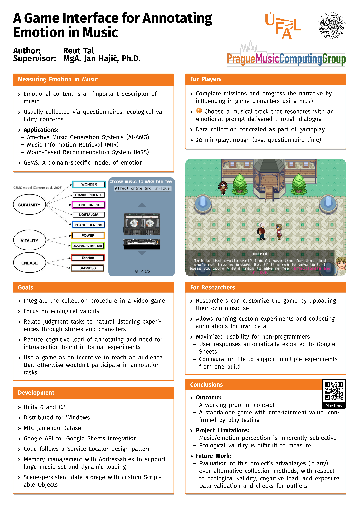

## Introduction

This project explores the intersection of AI, music, and emotion. Emerging applications in artificial intelligence rely on data that captures how music interacts with human emotions. Examples include affective music generation (AI-AMG), emotion recognition systems, and music information retrieval (MIR).
This data is usually collected through questionnaires, web scraping, or crowdsourcing. Given the complexity of emotions and the time-consuming nature of obtaining labels, most existing datasets are too small or noisy. Moreover, on-demand tasks do not necessarily evoke the same reactions as spontaneous events. Asking to observe emotions could unintentionally alter them, which results in data that fails to reflect natural listening experiences.

To address this, I created Symphony of Adventure – a role-playing video game that embeds data collection. Instead of filling out forms, players provide labels as part of the gameplay. This approach aims to simulate real-life scenarios where people naturally associate music with moods, in hopes of improving ecological validity and reducing the bias of introspection. 
The data collected classifies music based on emotional content and can serve as ground truth for machine learning task.

## Play it now!
You can play it by downloading the [Windows build](Symphony%20of%20advanture%20--%20Windows.zip). Please email reutgaming@gmail.com for a platform-specific build. 
 
## Game trailer

## Technologies 
The project was developed in C# using the Unity engine. For narrative design, I used Yarn Spinner.  
To manage collected data and maximize the usability of this tool for the layman, I integrated the Google Sheets API. This enables researchers to import metadata and automatically export players’ responses in real time. I added this so the data is organized and ready for analysis.  
To optimize performance, I used Unity’s Addressables system to load music at runtime from a (possibly large) set based on a configuration file. This avoids unnecessarily large builds. I also developed custom solutions, such as persistent Scriptable Objects for state preservation, to meet the project’s unique requirements.

## Thesis text
The thesis text that accompanies this project can be found [here](https://github.com/reuttaldev/Thesis-Text). It contains highly detailed description of the design, development, data collection process, user and researcher documentation and the theoretical background of model of emotions that stand behind it.

## Presentation poster

